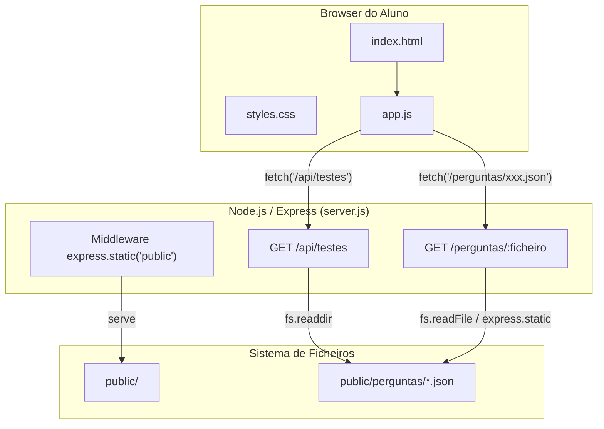

# Design Document: json-test-loader

## Overview

Esta funcionalidade transforma a aplicação de fichas de avaliação de um site estático front-end-only numa arquitectura cliente-servidor. O servidor Node.js/Express serve ficheiros estáticos e expõe endpoints REST para listar e devolver testes armazenados como ficheiros JSON. O frontend passa a carregar perguntas dinamicamente via API, apresentando um menu de seleção de teste antes de iniciar a ficha.

A lógica existente de navegação entre perguntas, pontuação parcial, revisão e geração de PDF é preservada — apenas a fonte de dados muda de um array JavaScript embutido para um endpoint HTTP que devolve JSON.

### Decisões de Design

1. **Servidor mínimo (Express)**: Escolhemos Express por ser a framework HTTP mais comum e simples em Node.js, adequada a um servidor que apenas serve estáticos e dois endpoints.
2. **Ficheiros JSON na pasta pública**: Os testes ficam em `public/perguntas/` e são servidos diretamente como estáticos, mas a listagem é feita via endpoint dedicado para permitir descoberta dinâmica.
3. **Sem base de dados**: Dada a simplicidade do caso de uso (fichas para alunos do 3.º ano), ficheiros JSON no disco são suficientes e eliminam dependências extras.
4. **Baralhamento no cliente**: O baralhamento de perguntas e opções continua a ser feito no frontend após receber os dados, mantendo a lógica existente.

## Architecture



### Fluxo de Dados

1. O browser pede `http://localhost:3000/` → Express serve `public/index.html`
2. `app.js` faz `GET /api/testes` → servidor lê `public/perguntas/`, filtra `.json`, devolve array de nomes
3. Aluno seleciona teste → `app.js` faz `GET /perguntas/{ficheiro}.json` → servidor devolve conteúdo JSON
4. `app.js` baralha perguntas e opções, renderiza a UI, e a partir daqui o fluxo é idêntico ao existente

## Components and Interfaces

### Servidor (`server.js`)

| Responsabilidade | Detalhes |
|---|---|
| Servir estáticos | `express.static('public')` na raiz |
| Listar testes | `GET /api/testes` → array de nomes de ficheiros |
| Devolver teste | `GET /perguntas/:ficheiro` → conteúdo JSON |
| Validação de segurança | Rejeitar nomes com `..`, `/`, `\` ou sem `.json` |
| Criação de pasta | Criar `public/perguntas/` se não existir ao iniciar |

#### API Endpoints

```
GET /api/testes
  Response 200: ["estudo_meio_3ano.json", "ciencias_2periodo.json"]
  Response 200: [] (pasta vazia)
  Response 500: { "error": "Erro ao ler a pasta de testes" }

GET /perguntas/:ficheiro
  Response 200: { titulo, disciplina, ano, periodo, data, perguntas: [...] }
  Response 400: { "error": "Nome de ficheiro inválido" }
  Response 404: { "error": "Ficheiro não encontrado" }
  Response 500: { "error": "Erro ao ler o ficheiro" }
```

### Frontend (`public/app.js`)

| Responsabilidade | Detalhes |
|---|---|
| Carregar lista de testes | `fetch('/api/testes')` ao iniciar |
| Preencher menu de seleção | Popular `<select>` com opções |
| Carregar teste selecionado | `fetch('/perguntas/{ficheiro}')` |
| Baralhamento | `baralharArray()` em perguntas e opções |
| Mapeamento correto→opção | Manter correspondência `c` ↔ `op` após baralhamento |
| Navegação, pontuação, revisão, PDF | Lógica existente mantida |

### Frontend (`public/index.html`)

Alterações mínimas:
- Adicionar `<select id="seletor-teste">` antes da secção de identificação
- Remover `<script src="perguntas.js"></script>`
- Tornar secções de identificação e perguntas inicialmente ocultas

## Data Models

### Ficheiro de Teste JSON (schema)

```json
{
  "titulo": "Ficha Final - Estudo do Meio",
  "disciplina": "Estudo do Meio",
  "ano": "3.º Ano",
  "periodo": "3.º Período",
  "data": "19/06/2026",
  "perguntas": [
    {
      "q": "Texto da pergunta",
      "op": ["Opção A", "Opção B", "Opção C", "Opção D"],
      "c": ["Opção A"],
      "t": "single"
    },
    {
      "q": "Texto da pergunta multi",
      "op": ["Opção A", "Opção B", "Opção C", "Opção D"],
      "c": ["Opção A", "Opção B"],
      "t": "multi"
    }
  ]
}
```

### Invariantes do Schema

| Campo | Tipo | Regra |
|---|---|---|
| `titulo` | string | Obrigatório, não vazio |
| `disciplina` | string | Obrigatório, não vazio |
| `ano` | string | Obrigatório, não vazio |
| `periodo` | string | Obrigatório, não vazio |
| `data` | string | Obrigatório, não vazio |
| `perguntas` | array | Mínimo 1 elemento |
| `perguntas[].q` | string | Obrigatório |
| `perguntas[].op` | array of string | Mínimo 2 elementos |
| `perguntas[].c` | array of string | Todos os valores devem existir em `op` |
| `perguntas[].t` | `"single"` \| `"multi"` | Se `single`: `c.length === 1`. Se `multi`: `2 <= c.length < op.length` |

### Estado da Aplicação (Frontend, em memória)

```typescript
// Pseudocódigo TypeScript para referência
interface AppState {
  testes: string[];              // lista de ficheiros disponíveis
  testeAtual: TestData | null;   // dados do teste carregado
  perguntasTeste: Pergunta[];    // perguntas baralhadas
  respostas: (string[] | null)[];// respostas do aluno
  atual: number;                 // índice da pergunta atual
  revisaoAtual: number;          // índice na revisão
  valor: number;                 // pontos por pergunta (100/n)
}
```

## Correctness Properties

*A property is a characteristic or behavior that should hold true across all valid executions of a system — essentially, a formal statement about what the system should do. Properties serve as the bridge between human-readable specifications and machine-verifiable correctness guarantees.*

### Property 1: Listing endpoint returns only JSON filenames

*For any* set of files in the directory `public/perguntas/` (including files with extensions other than `.json`), the `GET /api/testes` endpoint SHALL return an array containing exclusively the filenames that end in `.json`, and no other files.

**Validates: Requirements 2.1**

### Property 2: Filename validation rejects unsafe inputs

*For any* string that contains path traversal characters (`..`, `/`, `\`) or does not end in `.json`, the `GET /perguntas/:ficheiro` endpoint SHALL return HTTP 400 and never attempt to read a file from disk.

**Validates: Requirements 3.3**

### Property 3: Baralhamento is a valid permutation preserving correctness

*For any* array of questions loaded from a test file, after applying `baralharArray` to the questions array and to each question's `op` array: (a) the resulting arrays contain exactly the same elements as the originals (no duplicates, no omissions), and (b) for each question, every value in `c` still exists in the shuffled `op` array, preserving answer verification validity.

**Validates: Requirements 5.2, 5.3**

### Property 4: Test file schema validation

*For any* JSON object, the validation function SHALL accept it if and only if it contains all required top-level fields (`titulo`, `disciplina`, `ano`, `periodo`, `data`, `perguntas` with ≥1 element) and each question has `q` (string), `op` (array ≥2), `c` (array where all values ∈ `op`), and `t` ("single" with `c.length === 1`, or "multi" with `2 <= c.length < op.length`).

**Validates: Requirements 6.1, 6.2, 6.3, 6.4, 6.5**

### Property 5: Single question scoring

*For any* single-type question with point value `v = 100/n` (where n is total questions): if the selected answer equals the correct answer, the score SHALL be `v`; if the selected answer differs from the correct answer, the score SHALL be `0`.

**Validates: Requirements 7.2, 7.3**

### Property 6: Multi question scoring with partial credit

*For any* multi-type question with point value `v = 100/n`, correct answers set `C`, and student selection `S`: if `S` contains any value not in `C`, the score SHALL be `0`; otherwise the score SHALL be `(v / |C|) × |S ∩ C|`, rounded to 1 decimal place.

**Validates: Requirements 7.4, 7.5**

### Property 7: Total maximum score equals 100

*For any* test with `n` questions where all questions are answered perfectly, the total score SHALL equal 100 (within floating-point tolerance of ±0.1 due to rounding).

**Validates: Requirements 7.1**

### Property 8: Score rounding invariant

*For any* scoring calculation, the result SHALL be a number with at most 1 decimal place, computed using mathematical half-up rounding (i.e., `Math.round(x * 10) / 10`).

**Validates: Requirements 7.6**

## Error Handling

### Servidor

| Cenário | Resposta | Detalhes |
|---|---|---|
| Pasta `public/perguntas/` não existe | Criar ao iniciar ou `[]` no endpoint | O servidor tenta `fs.mkdir` com `recursive: true` no arranque |
| Erro ao ler diretório | HTTP 500 + `{ error }` | Captura exceção de `fs.readdir` |
| Ficheiro não encontrado | HTTP 404 + `{ error }` | `fs.access` ou `ENOENT` em `fs.readFile` |
| Nome de ficheiro inválido | HTTP 400 + `{ error }` | Validação antes de qualquer acesso ao disco |
| Erro ao ler ficheiro | HTTP 500 + `{ error }` | Qualquer erro não-ENOENT em `fs.readFile` |
| Porta ocupada | `process.exit(1)` + stderr | Listener `error` no `server.listen` |

### Frontend

| Cenário | Comportamento |
|---|---|
| API `/api/testes` falha (rede/500) | Mensagem de erro visível, secções ocultas |
| API `/perguntas/:ficheiro` falha | Mensagem de erro visível, secções ocultas |
| JSON inválido na resposta | `try/catch` no `response.json()`, apresentar erro |
| jsPDF não disponível (CDN falha) | `try/catch` em `exportarPDF()`, alert ao aluno |
| jsPDF lança exceção durante geração | `catch(e)`, alert com mensagem genérica |

### Estratégia Geral de Erros

- **Falha silenciosa zero**: Todos os erros apresentam feedback ao utilizador
- **Graceful degradation**: Se o PDF falha, o teste e revisão continuam funcionais
- **Sem exposição de internos**: Mensagens de erro no frontend são user-friendly; detalhes técnicos vão para `console.error`

## Testing Strategy

### Abordagem

A estratégia de testes segue uma abordagem dual:
- **Testes unitários**: Verificam exemplos específicos, edge cases e condições de erro
- **Testes de propriedade (PBT)**: Verificam propriedades universais com inputs gerados automaticamente

### Framework e Ferramentas

- **Test runner**: Vitest (leve, rápido, compatível com ESM e CommonJS)
- **Property-based testing**: fast-check (biblioteca PBT para JavaScript/TypeScript)
- **HTTP testing**: supertest (para testar endpoints Express sem iniciar servidor)

### Testes de Propriedade (PBT)

Cada propriedade do documento de design será implementada como um único teste com fast-check:
- Mínimo **100 iterações** por teste de propriedade
- Cada teste etiquetado com: `Feature: json-test-loader, Property {N}: {descrição}`

| Property | Módulo alvo | Gerador |
|---|---|---|
| 1: Listing JSON only | `server.js` (handler `/api/testes`) | Arbitrary arrays of filenames with mixed extensions |
| 2: Filename validation | `server.js` (handler `/perguntas/:ficheiro`) | Arbitrary strings with path chars and extensions |
| 3: Baralhamento permutation | `app.js` (`baralharArray`) | Arbitrary arrays of questions with options |
| 4: Schema validation | Validator function (novo) | Arbitrary JSON objects with/without required fields |
| 5: Single scoring | `app.js` (`calcularPontosPergunta`) | Arbitrary single questions with correct/incorrect answers |
| 6: Multi scoring | `app.js` (`calcularPontosPergunta`) | Arbitrary multi questions with subsets of selections |
| 7: Total = 100 | `app.js` (`calcularTotal`) | Arbitrary test sizes with perfect answers |
| 8: Rounding | `app.js` (scoring functions) | Arbitrary test configurations producing fractional scores |

### Testes Unitários (exemplos e edge cases)

- Servidor: arranque com sucesso, porta ocupada, pasta vazia, pasta inexistente
- API: ficheiro não encontrado (404), path traversal (400), leitura com erro (500)
- Frontend: menu carregado com testes, secções ocultas inicialmente, seleção carrega teste
- Navegação: primeira pergunta (Anterior disabled), última (Submeter visível), respostas preservadas
- Validação: submissão sem nome, sem número, sem resposta
- Revisão: apresentação correta com indicador correto/parcial/incorreto
- PDF: geração com sucesso, falha graceful com alert
- Certificado: aparece com ≥90, não aparece com <90

### Testes de Integração

- Fluxo completo: iniciar servidor → listar testes → carregar teste → responder → submeter → verificar pontuação
- Adição dinâmica: adicionar ficheiro, verificar que aparece sem restart

### Organização dos Ficheiros de Teste

```
tests/
  server.test.js         # Testes do servidor (unitários + integração)
  scoring.test.js        # Testes de pontuação (unitários + PBT)
  shuffle.test.js        # Testes de baralhamento (PBT)
  validation.test.js     # Testes de validação de schema (PBT)
```

